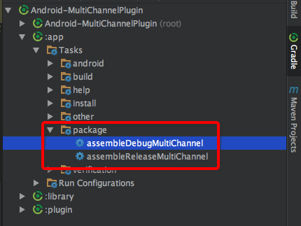

# Android-MultiChannelPlugin
多渠道打包插件，支持添加额外的信息extInfo，并提供library 读取渠道id和extInfo，用法如下：

 [json数据格式](channel.json)

<font color="red">注意：最新的版本只支持python3，升级前注意升级你的python环境,并装好了json、subprocess、zipfile、argparse依赖</font>
```
pip3 install json
pip3 install subprocess
pip3 install zipfile
pip3 install argparse
```

### 怎么使用plugin
1 . 在buildscript中添加如下配置
```
buildscript {
    repositories {
       maven { url 'https://jitpack.io' }
    }
    dependencies {
        // 使用python3
        classpath 'com.github.403462630.Android-MultiChannelPlugin:plugin:1.0.0'
    }
}
```

2 . 在app的build.gradle中配置如下：
```
apply plugin: 'multiChannel'

multiChannel {
    //签名密码
    storePassword "123456"
    //签名证书
    storeFile file('../test.jks')
    keyAlias "test"
    keyAliasPassword "123456"
    jiagu {
        //是否开启加固功能
        isEnable true
        //账号
        username '--'
        //密码
        password "--"
        //加固jar包的路径
        path "/Users/fangcan/Downloads/360jiagubao_mac/jiagu"
    }
    channel {
        //本地多渠道配置json文件
        url 'file:../channel.json'
        //或者是get方式的http请求
//        url "http://xxxx"
    }
    //生成的apk名称，code、id、name对应json中的key
    apkName "app-{code}-{id}-{name}-${android.defaultConfig.versionName}.apk"
}

```
3 . 执行如下gradle命令：
```
打debug包的多渠道包
./gradlew assembleDebugMultiChannel 
打release包的多渠道包
./gradlew assembleReleaseMultiChannel 
还可以使用-PchannelIds参数指定打指定渠道包(多个用,隔开)
./gradlew assembleReleaseMultiChannel -PchannelIds=1,2
还可以使用-PexchannelIds参数指定过滤某些渠道包(多个用,隔开)
./gradlew assembleReleaseMultiChannel -PchannelIds=1,2 -PexchannelIds=1

还可以对已存在的apk打多渠道包,用-PapkPath指定apk的位置
./gradlew packageMultiChannel -PapkPath=app/build/outputs/apk/app-debug.apk -PchannelIds=1,2 -PexchannelIds=1


1.4.0 新增功能（360加固）
新增-PjiaguChannelIds（指定哪些渠道需要加固，默认所有） 和 -PjiaguExchannelIds（指定哪些不需要加固）参数
//注意不能对debug包加固
./gradlew assembleReleaseMultiChannel -PjiaguChannelIds=9

```

如果你在app的build.gradle中添加了productFlavors，那么task的名字就不一定是assembleDebugMultiChannel和assembleReleaseMultiChannel了,
你可以在下图中查看task的名字



### 怎么读取渠道和extInfo信息
1. 在build.gradle中配置如下：
```
repositories {
    maven { url 'https://jitpack.io' }
}
dependencies {
    implementation 'com.github.403462630.Android-MultiChannelPlugin:library:1.0.0'
}
```
2. 使用api
```
//只需要初始化一次
ChannelReader.init(this);
//获取渠道id
ChannelReader.getChannelId(this)
//获取渠道ExtInfo
Map map = ChannelReader.getExtInfo(this);
```


## 注意
1. 本插件在使用了python3和shell脚本，请保证你的电脑支持python3和shell
2. 证书密码和别名密码要一致（暂时不知道为啥，不然用apksigner签名报错）
